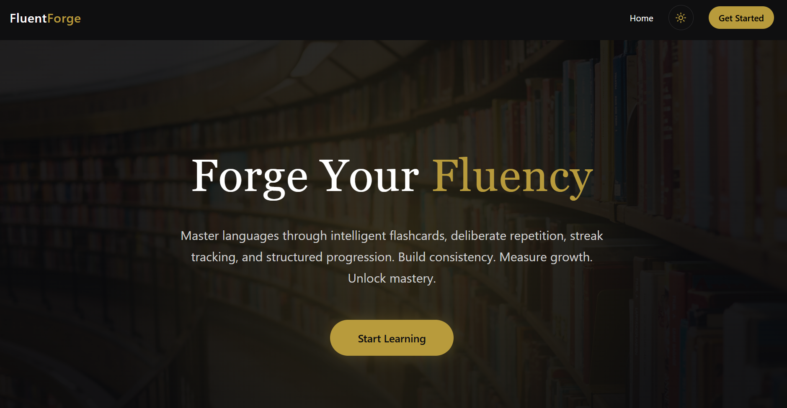
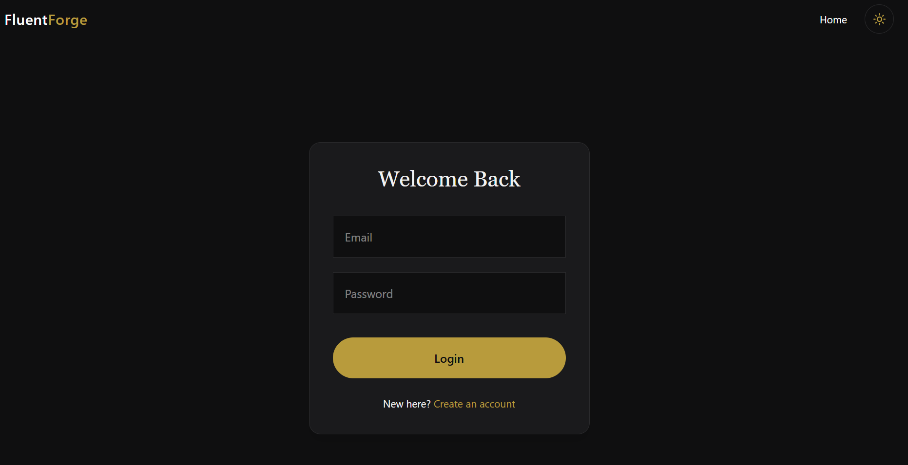
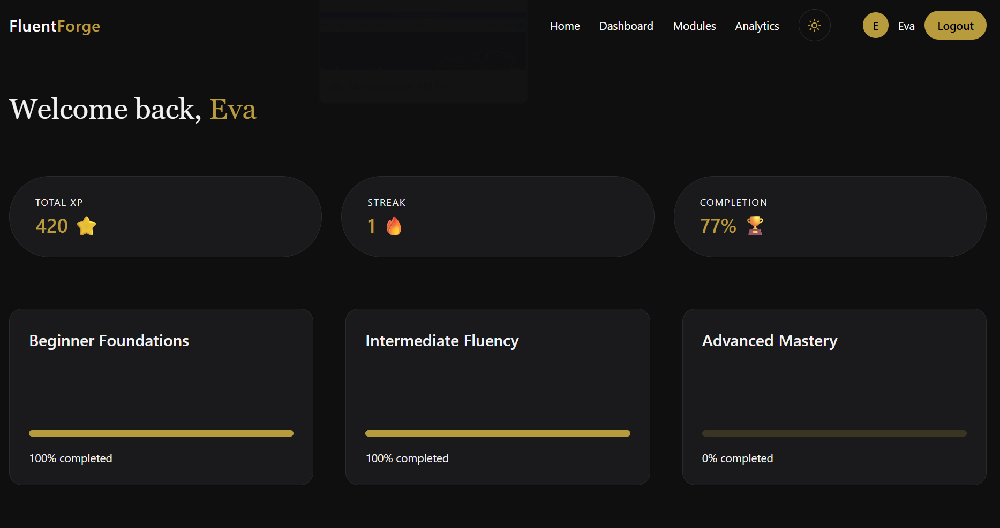
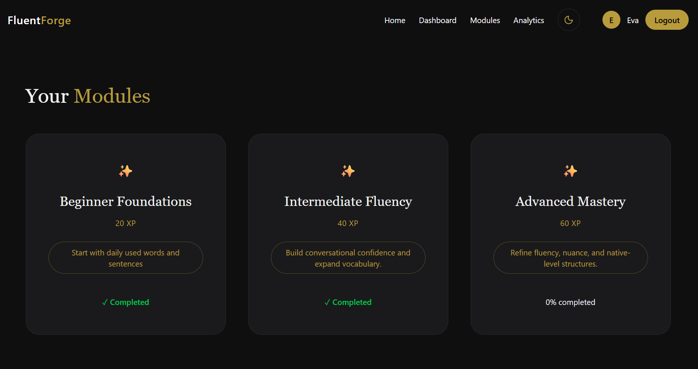
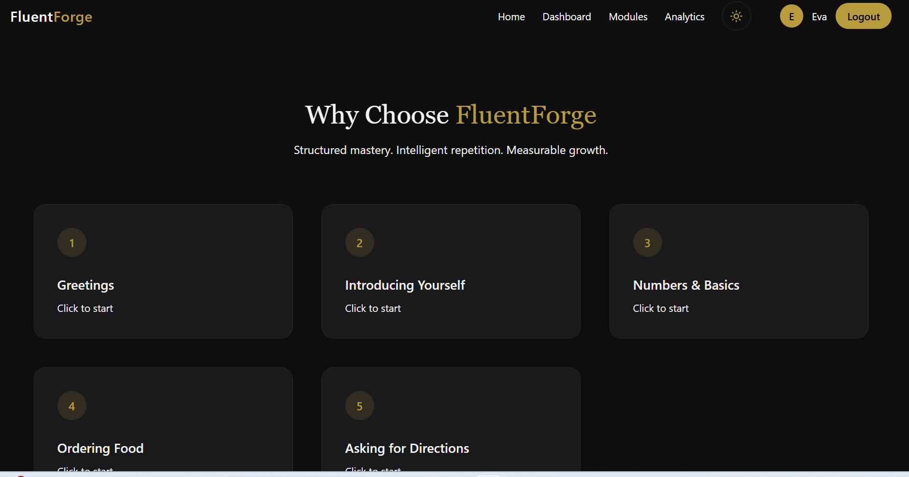
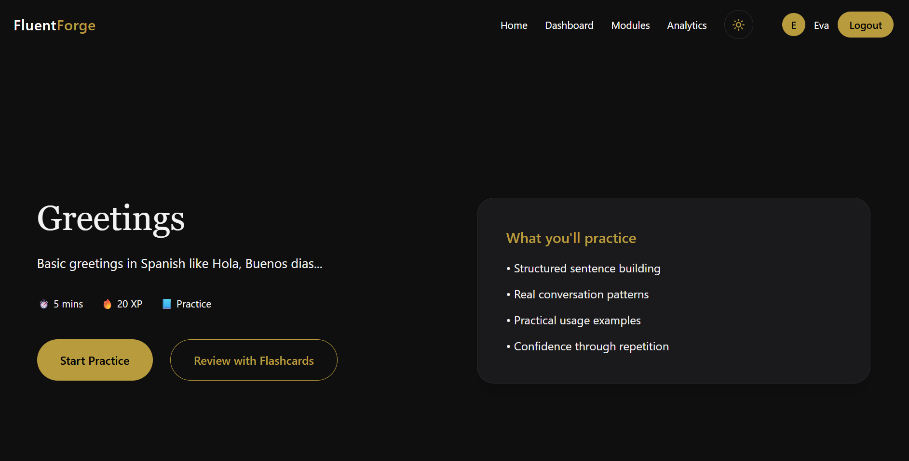
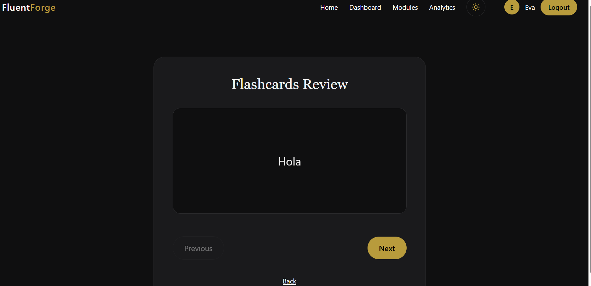
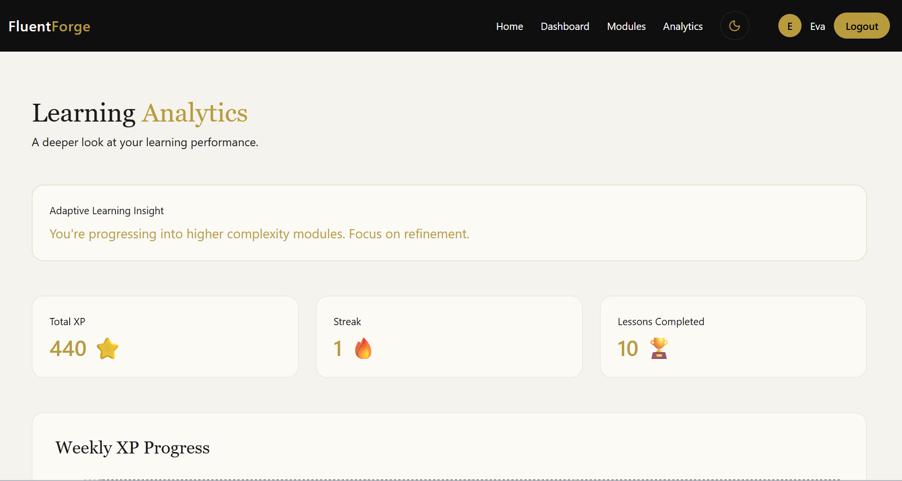
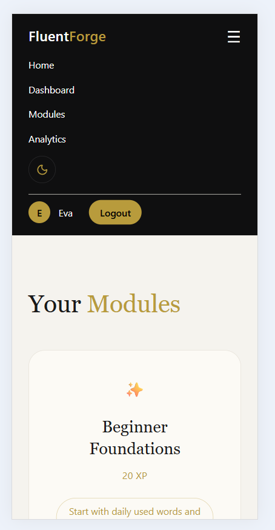

# FluentForge – Frontend Application

## Project Overview

FluentForge is a premium full-stack language learning platform built with **React**, **Tailwind CSS**, and **ShadCN UI**.

The frontend communicates with a **Node.js + Express backend** and **Supabase database** to deliver:

- Secure authentication
- Structured learning modules
- Sequential lesson unlocking
- Interactive quiz practice
- Flashcard revision system
- XP & streak gamification
- Analytics dashboard with XP tracking
- Dark / Light theme toggle

The UI follows a refined dark-first design system with premium gold accents and a fully responsive layout.

---

## Live Application

**Frontend (Netlify):**  
https://timely-cat-2e2a41.netlify.app/

**Backend API (Render):**  
https://fluentforge-backend.onrender.com

### Demo Credentials

- **Email:** eva@gmail.com  
- **Password:** 123456  

---

## Tech Stack

- React (Vite)
- Tailwind CSS
- ShadCN UI
- Axios
- React Router DOM
- Context API
- React Hot Toast
- Lucide React Icons
- Web Speech API (Browser Native)

---

## Project Architecture

### Folder Structure

src/
│
├── components/
│ ├── Navbar.jsx
│ ├── XPChart.jsx
│ ├── ThemeToggle.jsx
│
├── pages/
│ ├── Landing.jsx
│ ├── Signup.jsx
│ ├── Login.jsx
│ ├── Dashboard.jsx
│ ├── Modules.jsx
│ ├── ModuleLessons.jsx
│ ├── Lesson.jsx
│ ├── Flashcards.jsx
│ ├── Analytics.jsx
│
├── context/
│ ├── AuthContext.jsx
│ ├── ThemeContext.jsx
│
├── api/
│ └── axios.js
│
├── routes/
│ └── AppRoutes.jsx
│
└── App.jsx


---

## Core Features

### Authentication

- Signup & Login with JWT
- Token stored in `localStorage`
- Protected routes via `AuthContext`
- Axios interceptor attaches Bearer token automatically

---

### Dashboard

Displays:

- Total XP
- Current streak
- Completion percentage
- Module progress visualization

---

### Modules & Lessons

- Sequential module unlocking
- Lesson-level locking
- Dynamic progress calculation
- Interactive multiple-choice practice
- Real-time answer validation
- XP calculation on completion

---

### Flashcards

- Lesson-based flashcard retrieval
- Interactive 3D flip animation
- Front / Back learning reinforcement
- Sequential navigation

---

### Analytics

Displays:

- Total XP
- Streak
- Lessons completed
- Weekly XP chart
- Adaptive insight engine based on activity

---

### Theme System

- Dark-first design
- Light mode toggle
- Theme preference saved in `localStorage`
- Global CSS variable system

---

## API Integration

All API calls are handled via a centralized Axios instance:

- Base URL configured using environment variable
- Automatic JWT header injection
- Clean service-based API structure

### Example Axios Configuration

```javascript
export const api = axios.create({
  baseURL: import.meta.env.VITE_API_URL
})
```
---

## Responsiveness

- Tailwind responsive breakpoints (`md:`, `lg:`)
- Flex and Grid layouts
- Mobile hamburger navigation
- Tablet and desktop optimized UI

---

---

## Installation (Local Setup)

### 1. Clone Repository

```bash
git clone <frontend-repo-url>
cd frontend
```

### 2. Install Dependencies

```bash
npm install
```

### 3. Configure Environment Variables

Create a `.env` file:

```env
VITE_API_URL=https://fluentforge-backend.onrender.com
```

### 4. Run Application

```bash
npm run dev
```

Application runs locally at:

```
http://localhost:5173
```

---

## Deployment

Frontend is deployed on **Netlify**.

### Deployment Steps

1. Connect GitHub repository to Netlify
2. Add environment variable:

```
VITE_API_URL=https://fluentforge-backend.onrender.com
```

3. Build command:

```
npm run build
```

4. Publish directory:

```
dist
```

Live application:

```
https://timely-cat-2e2a41.netlify.app
```

---

## Engineering Highlights

- Clean modular architecture
- Reusable UI components
- Context-based state management
- JWT-secured API integration
- Sequential learning enforcement
- Gamified XP & streak engine
- Interactive flashcard system
- Production-ready deployment
- Fully integrated full-stack architecture

---

## Project Evaluation Focus

This project demonstrates:

- Proper frontend architecture
- Full-stack integration
- Clean UI/UX design
- Modular and scalable structure
- Industry-standard deployment practices

---

Screenshots:

## Application Screenshots

### Landing Page


### Login Page


### Dashboard


### Modules


### Lessons


### Lesson Practice


### Flashcards


### Analytics


### Mobile Responsive View


